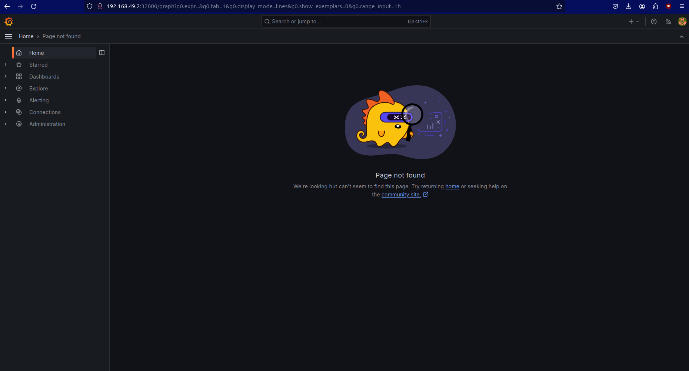
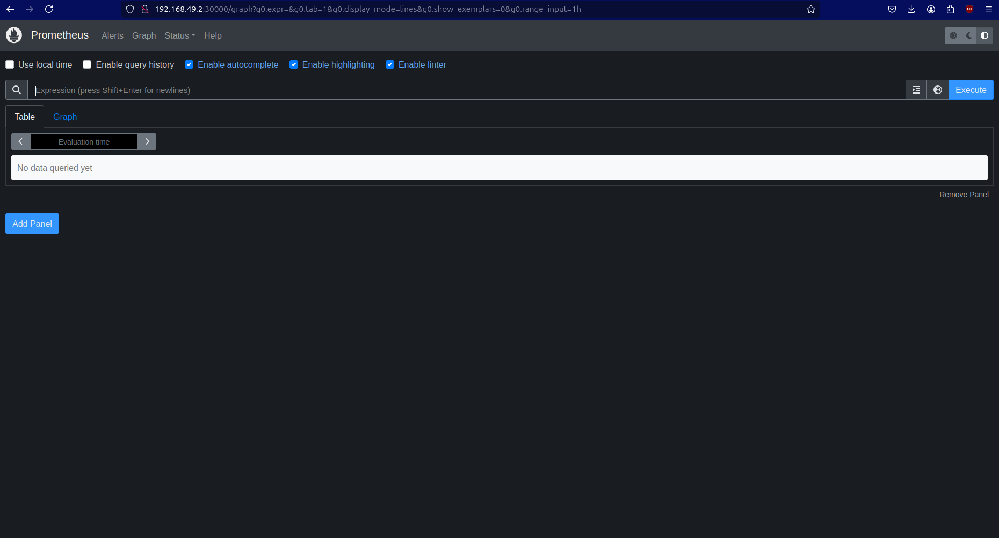

# minikube-test

This Kubernetes configuration sets up a monitoring stack in a single cluster using Prometheus for metrics collection and Grafana for visualization.

|                  Grafana                   |                  Prometheus                   |
|:------------------------------------------:|:---------------------------------------------:|
|  |  |

## Components

- **Prometheus**: An open-source systems monitoring and alerting toolkit. It scrapes and stores metrics from configured targets and provides a powerful query language and built-in alerting capabilities.

- **Grafana**: An open-source platform for data visualization and monitoring. It allows you to create dashboards, panels, and alerts based on the metrics collected by Prometheus.

## Deployment Details

- Namespace: `monitoring`
  - All components are deployed in the `monitoring` namespace to isolate them from other applications.

- Prometheus:
  - Deployed as a Kubernetes Deployment with a single replica.
  - Configured using a ConfigMap (`prometheus-config`) that specifies the scraping interval and targets.
  - Prometheus data is stored in an `emptyDir` volume for simplicity (not recommended for production use).
  - Exposed as a Kubernetes Service of type NodePort on port 30000.

- Grafana:
  - Deployed as a Kubernetes Deployment with a single replica.
  - Preconfigured with an admin user and password for initial access.
  - Exposed as a Kubernetes Service of type NodePort on port 32000.

## Usage

1. Apply the Kubernetes configuration files to create the necessary resources.
2. Access Prometheus using `http://<NODE-IP>:30000` and Grafana using `http://<NODE-IP>:32000`.
   - Replace `<NODE-IP>` with the IP address of any node in your Kubernetes cluster.
3. In Grafana, configure Prometheus as a data source and start creating dashboards to visualize the collected metrics.

